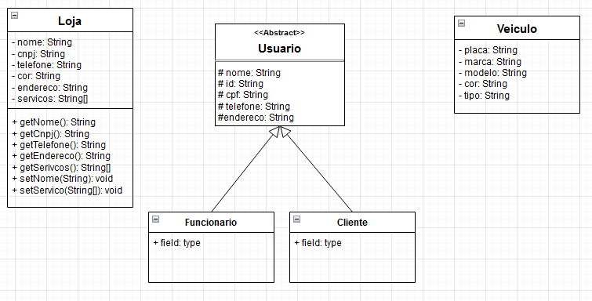

# Projeto Marketplace Lava Jato

## Introdução
  Nos últimos anos, a indústria automotiva tem experimentado um crescimento constante, impulsionado pela necessidade crescente de transporte pessoal e comercial. Consequentemente, a demanda por serviços de manutenção e limpeza de veículos, como lava jatos, tem aumentado significativamente. No entanto, a maioria dos lava jatos tradicionais ainda opera de maneira offline, o que limita sua capacidade de alcançar novos clientes e de otimizar a gestão de seus serviços.  
  
  Apesar da demanda crescente muitos proprietários de veículos tem dificuldades de encontrar esse serviço de forma confiável e rápida com bom custo benefício e de fácil agendamento. Além disso, os lava jatos costumam enfrentam dificuldades ao gerenciar agendamentos, captar novos clientes e divulgar o estabelecimento. Motivados a atacar o problema e dispostos a resolver a situação, este projeto visa a criação de um marketplace para lava jatos a fim de conectar os proprietários de veículos com os estabecimentos de lava jatos. 

## Objetivos
### Objetivo Geral

### Objetivos específicos

## Organização da equipe
  Para a realização do projeto contamos com uma equipe de três desenvolvedores:  
  Erick Fleury  
  Maria Luiza Cardoso  
  Raingredi Mendes - Front-End
  
## Modelagem inicial

## UML do projeto

